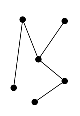
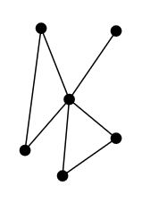
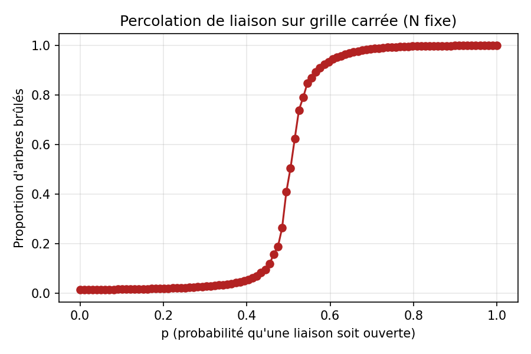
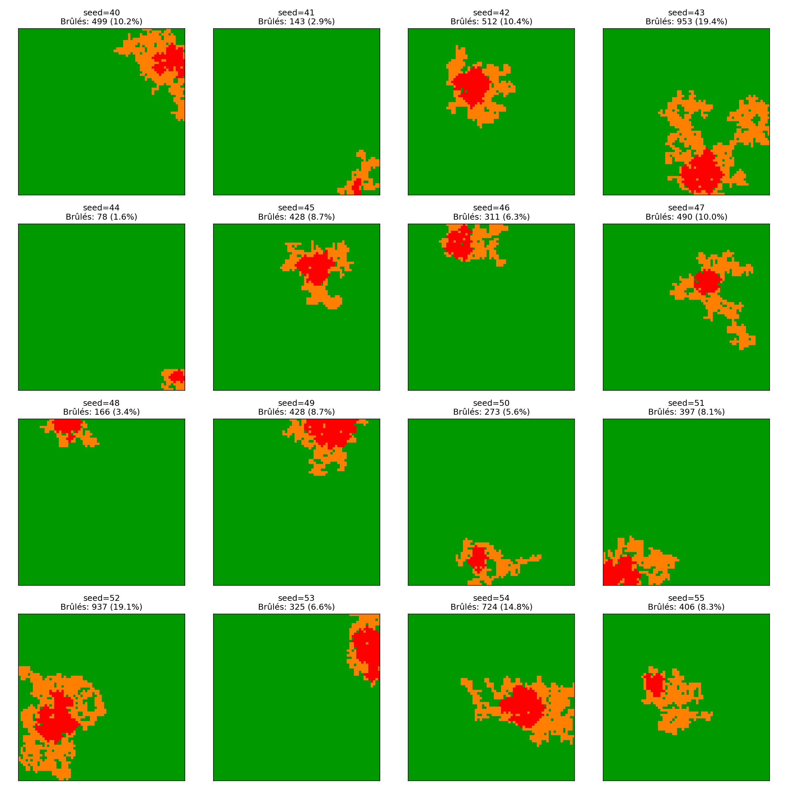
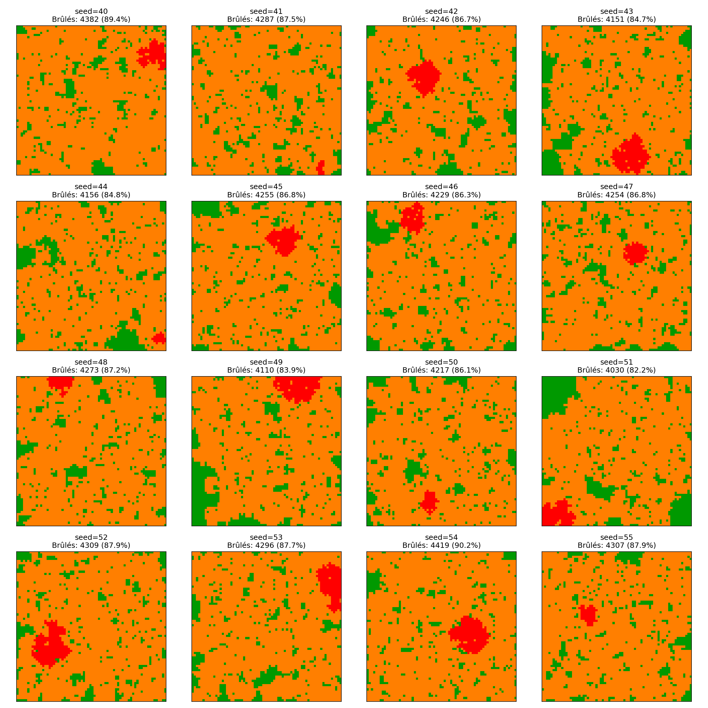

## Modéliser la propagation d'une épidémie

::: {.incremental}
- $S_J$ : Proportion de personnes **Saines** au **Jour $J$**
- $I_J$ : Proportion de personnes **Infectées** au **Jour $J$**
- $\gamma$ : Taux de guérison
- $R_0$ : Nombre moyen de nouvelles contaminations dues à un infecté
:::

::: {.fragment}
::: {.r-stack}
$$
I_{J+1}-I_J = \gamma I_J(R_0 S_J - 1).
$$

::: {.fragment .brace-down}
$$
\phantom{I_{J+1}-I_J =\,}\underbrace{\phantom{\gamma I_J}}_{\geq 0}\phantom{(R_0 S_J - 1).}
$$
:::

::: {.fragment .brace-down}
$$
\phantom{I_{J+1}-I_J =\gamma I_J(}\underbrace{\phantom{R_0 S_J - 1}}_{\geq 0\ \mathrm{ou}\ \leq 0\ \mathrm{?}}\phantom{).}
$$
:::
:::
:::

---

### Le seuil critique $R_0=1$

::: {.fragment}
$R_0$ représente la **connectivité** du "graphe de contamination" :
:::

::: {.fragment}
::: {.columns}
::: {.column width=50%}
::: {.columns}
::: {.column width=40%}

:::

::: {.column width=50%}

Peu connecté
:::
:::
:::

::: {.column width=50% .fragment}
::: {.columns}
::: {.column width=40%}

:::

::: {.column width=50%}

Très connecté
:::
:::
:::
:::
:::

::: {.notes}
Parler de $R_0\leq,\ =,\ \geq 1$
:::

---

::: {.center-v}
::: {.columns}
::: {.column width=50%}

:::

::: {.column width=50% .fragment}

:::
:::
:::

## Modéliser la propagation d'un feu de forêt

::: {.incremental}
- On modélise une forêt par une **grille** de $N\times N$ cases
- On choisit une région de départ de feu
- Le feu se propage vers le Nord, l'Est, le Sud ou l'Ouest avec une certaine **probabilité $p$**
:::

::: {.fragment}
$\Longrightarrow\quad$ C'est encore une histoire de **connectivité** du "graphe de la forêt" !

::: {.columns}
::: {.column width=50%}
::: {.columns}
::: {.column width=40%}

:::

::: {.column width=50%}

Peu connecté
:::
:::
:::

::: {.column width=50%}
::: {.columns}
::: {.column width=40%}

:::

::: {.column width=50%}

Très connecté
:::
:::
:::
:::
:::

---

### Le seuil critique $p_c$

::: {.notes}
Parler du choix pour définir la probabilité critique (quel proportion d'arbres brûlés on s'autorise ?)
:::

::: {.fragment}

:::

---

### Illustrations ($p<p_c$)

::: {.columns}
::: {.column width=50%}
{width=80% fig-align="center"}
:::

::: {.column width=50% .fragment}
{width=80% fig-align="center"}
:::
:::

::: {.fs-80}
- [En rouge]{style="color: rgb(100%,0%,0%)"} : la région initiale choisie
- [En orange]{style="color: rgb(100%,50%,0%)"} : les arbres brûlés
- [En vert]{style="color: rgb(0%,60%,0%)"} : les arbres sains
:::

---

### Illustrations ($p>p_c$)

::: {.columns}
::: {.column width=50%}
{width=80% fig-align="center"}
:::

::: {.column width=50% .fragment}
{width=80% fig-align="center"}
:::
:::

::: {.fs-80}
- [En rouge]{style="color: rgb(100%,0%,0%)"} : la région initiale choisie
- [En orange]{style="color: rgb(100%,50%,0%)"} : les arbres brûlés
- [En vert]{style="color: rgb(0%,60%,0%)"} : les arbres sains
:::

## Comparaison des deux phénomènes

::: {.compare}

::: {.row .fragment}
::: {.card} 
$p$ 
:::

  <svg viewBox="0 0 100 10" width="100%" height="14" style="color:#000">
    <defs>
      <!-- auto-start-reverse flips the START marker so it points left -->
      <marker id="ah" markerWidth="8" markerHeight="8" refX="4" refY="4"
              orient="auto-start-reverse">
        <polygon points="0,0 8,4 0,8" fill="currentColor"></polygon>
      </marker>
    </defs>
    <line x1="6" y1="5" x2="94" y2="5"
          stroke="currentColor" stroke-width="2"
          marker-start="url(#ah)" marker-end="url(#ah)"/>
  </svg>

::: {.card}
$R_0$ 
:::
:::

::: {.row .fragment}
::: {.card} 
$p_c$ (au choix !) 
:::   

  <svg viewBox="0 0 100 10" width="100%" height="14" style="color:#000">
    <defs>
      <!-- auto-start-reverse flips the START marker so it points left -->
      <marker id="ah" markerWidth="8" markerHeight="8" refX="4" refY="4"
              orient="auto-start-reverse">
        <polygon points="0,0 8,4 0,8" fill="currentColor"></polygon>
      </marker>
    </defs>
    <line x1="6" y1="5" x2="94" y2="5"
          stroke="currentColor" stroke-width="2"
          marker-start="url(#ah)" marker-end="url(#ah)"/>
  </svg>

::: {.card} 
$1$ 
:::
:::

::: {.row .fragment}
::: {.card} 
$p < p_c$ 
:::   

  <svg viewBox="0 0 100 10" width="100%" height="14" style="color:#000">
    <defs>
      <!-- auto-start-reverse flips the START marker so it points left -->
      <marker id="ah" markerWidth="8" markerHeight="8" refX="4" refY="4"
              orient="auto-start-reverse">
        <polygon points="0,0 8,4 0,8" fill="currentColor"></polygon>
      </marker>
    </defs>
    <line x1="6" y1="5" x2="94" y2="5"
          stroke="currentColor" stroke-width="2"
          marker-start="url(#ah)" marker-end="url(#ah)"/>
  </svg>

::: {.card} 
$R_0 < 1$ 
:::
:::

::: {.row .fragment}
::: {.card} 
$p > p_c$ 
:::   

  <svg viewBox="0 0 100 10" width="100%" height="14" style="color:#000">
    <defs>
      <!-- auto-start-reverse flips the START marker so it points left -->
      <marker id="ah" markerWidth="8" markerHeight="8" refX="4" refY="4"
              orient="auto-start-reverse">
        <polygon points="0,0 8,4 0,8" fill="currentColor"></polygon>
      </marker>
    </defs>
    <line x1="6" y1="5" x2="94" y2="5"
          stroke="currentColor" stroke-width="2"
          marker-start="url(#ah)" marker-end="url(#ah)"/>
  </svg>

::: {.card} 
$R_0 > 1$ 
:::
:::

:::

## Conclusion

::: {.fragment}
**Modéliser un phénomène permet de le comprendre, et donc de mieux le contrôler.**
:::

::: {.incremental}
- (Epidémies) Facteurs de diminution de $R_0$ :
  + Confinement ($\downarrow$ le nombre de contacts par jour)
  + Hygiène/Port du masque ($\downarrow$ la probabilité de transmission)
  + Isolement des personnes infectées ($\downarrow$ la durée efficace de la maladie)
- (Incendies) Facteurs de diminution de $p$ :
  + Débroussaillement
  + Brûlage tactique
:::

## Merci de votre attention ! {.final-slide}

