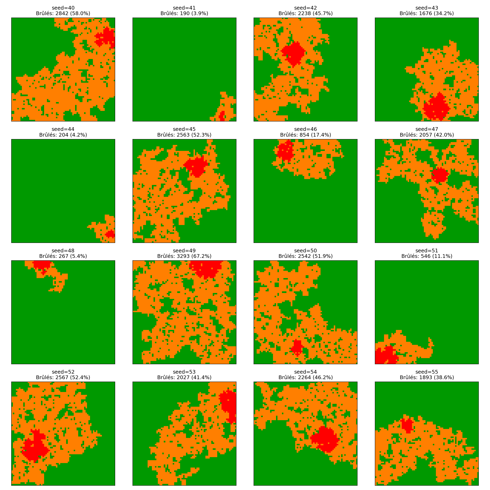

## Modéliser la propagation d'une épidémie

::: {.incremental}
- $S_J$ : Proportion de personnes **Saines** au **Jour $J$**
- $I_J$ : Proportion de personnes **Infectées** au **Jour $J$**
- $\gamma$ : Taux de guérison
- $R_0$ : Nombre moyen de nouvelles contaminations dues à un infecté
:::

::: {.fragment}
::: {.r-stack}
$$
I_{J+1}-I_J = \gamma I_J(R_0 S_J - 1).
$$

::: {.fragment .brace-down}
$$
\phantom{I_{J+1}-I_J =\,}\underbrace{\phantom{\gamma I_J}}_{\geq 0}\phantom{(R_0 S_J - 1).}
$$
:::

::: {.fragment .brace-down}
$$
\phantom{I_{J+1}-I_J =\gamma I_J(}\underbrace{\phantom{R_0 S_J - 1}}_{\geq 0\ \mathrm{ou}\ \leq 0\ \mathrm{?}}\phantom{).}
$$
:::
:::
:::

---

### Le seuil critique $R_0=1$

::: {.fragment}
$R_0$ représente la "connectivité" du graphe de contamination :
:::

::: {.fragment}
::: {.columns}
::: {.column width=50%}
::: {.columns}
::: {.column width=40%}

:::

::: {.column width=50%}

Peu connecté
:::
:::
:::

::: {.column width=50% .fragment}
::: {.columns}
::: {.column width=40%}

:::

::: {.column width=50%}

Très connecté
:::
:::
:::
:::
:::

::: {.notes}
Parler de $R_0\leq,\ =,\ \geq 1$
:::

---

::: {.center-v}
::: {.columns}
::: {.column width=50%}

:::

::: {.column width=50% .fragment}

:::
:::
:::

## Modéliser la propagation d'un feu de forêt

::: {.incremental}
- On modélise une forêt par une **grille** de $N\times N$ cases
- On choisit une région de départ de feu
- Le feu se propage vers le Nord, l'Est, le Sud ou l'Ouest avec une certaine **probabilité $p$**
:::

::: {.fragment}
$\Longrightarrow\quad$ C'est encore une histoire de connectivité du graphe !
:::

---

### Le seuil critique $p=p_c$

::: {.notes}
Parler du choix pour définir la probabilité critique (quel proportion d'arbres brûlés on s'autorise ?)
:::

::: {.fragment}

:::

---

### Illustrations

::: {.columns}

::: {.column width=33% .fragment}

:::

::: {.column width=33% .fragment}

:::

::: {.column width=33% .fragment}

:::

:::

::: {.fragment}
- [En rouge]{style="color: rgb(100%,0%,0%)"} : la région initiale choisie
- [En orange]{style="color: rgb(100%,50%,0%)"} : les arbres brûlés
- [En vert]{style="color: rgb(0%,60%,0%)"} : les arbres sains
:::

## Conclusion

::: {.fragment}
**Modéliser un phénomène permet de le comprendre, et donc de mieux le contrôler.**
:::

::: {.incremental}
- (Epidémies) Facteurs de diminution de $R_0$ :
  + Confinement ($\downarrow$ le nombre de contacts par jour)
  + Hygiène/Port du masque ($\downarrow$ la probabilité de transmission)
  + Isolement des personnes infectées ($\downarrow$ la durée efficace de la maladie)
- (Incendies) Facteurs de diminution de $p$ :
  + Débroussaillement
  + Brûlage tactique
:::

## Merci de votre attention ! {.final-slide}